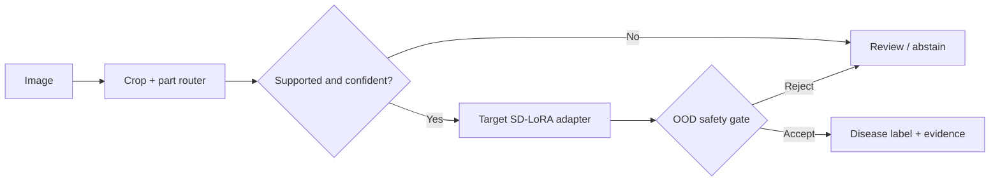

# AADS — Open-World Plant Disease Recognition

[](https://github.com/EfeErim/bitirmeprojesi/actions/workflows/ci.yml)
[](https://www.python.org/)
[](LICENSE)
[](evidence/controlled_demo_summary.json)

> A thesis project about the harder part of visual recognition: knowing when **not** to predict.

AADS routes a plant image to a crop/part specialist, applies a lightweight continual-learning adapter, and returns
either a disease label or a safe `review` decision. The public edition is a compact, recruiter-friendly extraction of
the full research system.

## What I built

- **Open-world selective routing** — unknown crops, unsupported parts, low-margin cases, and negative-prototype
  conflicts fail closed instead of being forced into a known disease.
- **Continual SD-LoRA adapter design** — eight crop/part specialists with replay, distillation, and bounded adapter
  updates to reduce forgetting.
- **Evidence-first ML delivery** — immutable release manifests, checksum verification, held-out OOD gates, and a
  GPU-free replay path separate engineering evidence from unsupported production claims.

## Verified snapshot

| Surface | Result |
|---|---:|
| Controlled acceptance rows | **48 / 48 passed** |
| Correct disease answers | **36 / 36** |
| Safe review / abstain rows | **12 / 12** |
| Negative false accepts | **0** |
| Wrong-part disease labels | **0** |
| Full private regression suite at public-transition snapshot | **1,132 passed** |

These are controlled-demo results, not a production-readiness claim. The exact run identity and integrity fields live
in [`evidence/controlled_demo_summary.json`](evidence/controlled_demo_summary.json).

## Try it in 30 seconds

```bash
git clone https://github.com/EfeErim/bitirmeprojesi.git
cd bitirmeprojesi
python -m pip install -e ".[dev]"
python -m aads_public replay
pytest -q
```

[Open the GPU-free evidence demo in Colab](https://colab.research.google.com/github/EfeErim/bitirmeprojesi/blob/master/notebooks/demo.ipynb)
or inspect the concise [`train_adapter.ipynb`](notebooks/train_adapter.ipynb) objective walkthrough.

[Download the checksum-pinned controlled-demo adapters](https://github.com/EfeErim/bitirmeprojesi/releases/tag/aads-public-demo-v1.0.0)
or inspect their machine-readable [`public_asset_manifest.json`](evidence/public_asset_manifest.json).

## System shape



The public package keeps the most interview-relevant ideas small:

- [`policy.py`](src/aads_public/policy.py) — fail-closed routing contract
- [`training.py`](src/aads_public/training.py) — continual objective and replay buffer
- [`evidence.py`](src/aads_public/evidence.py) — reproducible acceptance checks
- [`release.py`](src/aads_public/release.py) — anonymous public assets with SHA-256 verification

Deeper context: [`MODEL_CARD.md`](docs/MODEL_CARD.md) · [`ENGINEERING_NOTES.md`](docs/ENGINEERING_NOTES.md)

## Scope and limitations

- Supported targets: apricot, grape, strawberry, and tomato; fruit/leaf specialists where evidence exists.
- The 48-row set is a frozen customer-demo acceptance surface, not a statistical estimate of field performance.
- The larger stress surface exposed accuracy/coverage trade-offs; the system intentionally abstains on uncertain input.
- Public sample images are programmatically generated smoke inputs. They are not training or accuracy evidence.
- Model assets, when published, are controlled-demo artifacts and are explicitly marked **not production-ready**.

## License

Code and generated smoke assets are released under the [MIT License](LICENSE). Third-party model licenses remain
separate and must be followed when downloading their weights.
