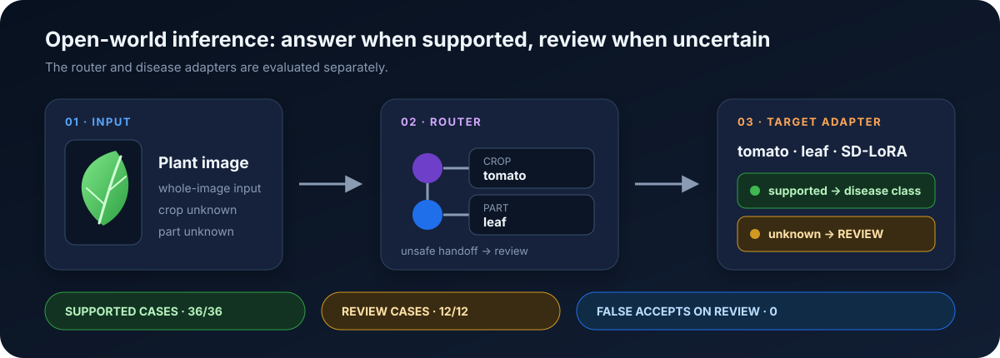
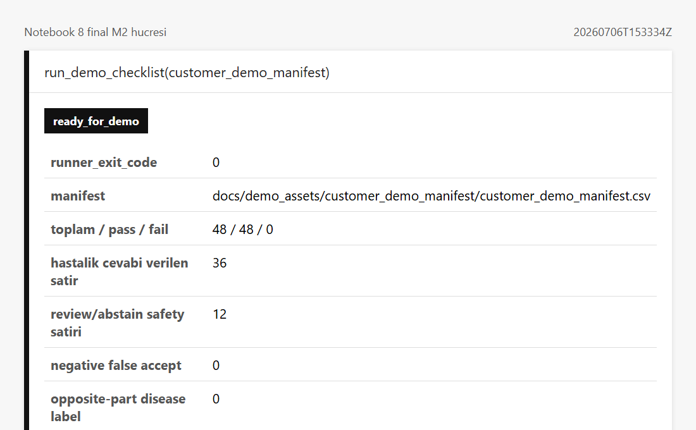

# AADS: Open-World Plant Disease Recognition

A conventional plant-disease classifier has to return a label even when the photo shows the wrong crop, the wrong
plant part, or no plant at all. I built AADS so it can route an image to the right specialist model and send
unsupported inputs to review instead of bluffing.

**[Run the demo in Colab](https://colab.research.google.com/github/EfeErim/aads-open-world-plant-disease/blob/master/colab_notebooks/8_auto_router_adapter_prediction.ipynb)** ·
**[Train in Colab](https://colab.research.google.com/github/EfeErim/aads-open-world-plant-disease/blob/master/colab_notebooks/2_train_continual_sd_lora_adapter.ipynb)** ·
**[Results and methodology](docs/methodology_and_results.md)** ·
**[Adapter release](https://github.com/EfeErim/aads-open-world-plant-disease/releases/tag/aads-public-demo-v1.1.2)**

> **Current status:** the fixed end-to-end demo passes; the production safety gate does not. The released weights are
> research/demo artifacts, not a plant-health diagnostic product.

## Start in Colab

Training and inference are designed for Google Colab. The notebooks bootstrap the repository, install their
dependencies, and manage the expected artifact layout; the intended user path does not require a local Python setup.

| Goal | Colab notebook | Role |
|---|---|---|
| Upload an image and run router-to-adapter inference | [Notebook 8](https://colab.research.google.com/github/EfeErim/aads-open-world-plant-disease/blob/master/colab_notebooks/8_auto_router_adapter_prediction.ipynb) | Primary inference and demo surface |
| Train one crop/part adapter | [Notebook 2](https://colab.research.google.com/github/EfeErim/aads-open-world-plant-disease/blob/master/colab_notebooks/2_train_continual_sd_lora_adapter.ipynb) | Primary training surface |
| Audit and prepare a dataset | [Notebook 0](https://colab.research.google.com/github/EfeErim/aads-open-world-plant-disease/blob/master/colab_notebooks/0_prepare_grouped_dataset_for_training.ipynb) | Data preparation before training |
| Reload and validate an exported adapter | [Notebook 3](https://colab.research.google.com/github/EfeErim/aads-open-world-plant-disease/blob/master/colab_notebooks/3_validate_exported_adapter_directly.ipynb) | Direct adapter validation |

Model-backed cells require a Hugging Face token with access to the gated DINOv3 backbone. Meaningful training also
requires your own images. Notebook 2 can create a deterministic synthetic sample, but that sample only checks the
pipeline and cannot support accuracy or readiness claims.

## What I built

This was my individual graduation project. I designed and implemented the data preparation, continual training,
crop/part router, OOD and review logic, artifact release, Colab interfaces, and CI evidence pipeline end to end.

AADS is a PyTorch pipeline for apricot, grape, strawberry, and tomato images. It first identifies the crop and plant
part, then loads one of eight target-specific SD-LoRA adapters built on
[DINOv3 ViT-L/16](https://github.com/facebookresearch/dinov3). The final decision is either a supported disease class
or `review`.

The project includes:

- continual adapter training and export;
- crop/part routing and open-set checks;
- OOD scoring with energy, feature-distance, and k-nearest-neighbor signals;
- typed inference payloads and checksum-verified adapter loading;
- Colab orchestration, automated tests, and replayable evaluation evidence.

## Results

### Fixed router-to-adapter demo

| 48-image manifest | Result |
|---|---:|
| Supported disease cases | **36 / 36** |
| Review/abstain cases | **12 / 12** |
| False accepts on review cases | **0** |
| Wrong-part disease labels | **0** |

  

  Actual Notebook 8 output from the frozen run ·
  <a href="evidence/controlled_demo_summary.json">inspect the machine-readable evidence</a>

All 48 recorded decisions matched the frozen manifest. This is a controlled pipeline check, not a field-accuracy
estimate.

### Adapter evaluation

| Held-out metric across eight adapters | Range |
|---|---:|
| Accuracy | 0.899-0.994 |
| Balanced accuracy | 0.836-0.994 |
| Macro-F1 | 0.810-0.993 |

The stricter behavioral-acceptance gate is currently **0/8 passed**. It checks classification quality, minimum sample
counts, false rejections, and same-crop unknown-disease rejection together. No released adapter clears every
requirement yet, so the system should not be used for autonomous diagnosis.

The [methodology and results](docs/methodology_and_results.md) page explains the evaluation design, per-adapter
failures, literature, and evidence limits.

## Public evidence

The controlled-demo records are checked into the repository so the published result can be inspected without access
to the private training images:

- [`controlled_demo_summary.json`](evidence/controlled_demo_summary.json)
- [`controlled_demo_rows.json`](evidence/controlled_demo_rows.json)
- [`latest_behavioral_acceptance_summary.json`](evidence/latest_behavioral_acceptance_summary.json)

GitHub Actions verifies the evidence summary alongside the repository contracts, notebook smoke tests, unit tests,
integration tests, Ruff, mypy, and the 78% coverage gate.

## Code map

The Colab notebooks are thin interfaces over maintained workflows:

| Area | Maintained implementation |
|---|---|
| End-to-end inference | [`src/workflows/inference.py`](src/workflows/inference.py) |
| Continual training | [`src/workflows/training.py`](src/workflows/training.py) |
| Crop/part routing | [`src/router/`](src/router/) |
| Adapter inference | [`src/pipeline/`](src/pipeline/) |
| OOD and acceptance | [`src/ood/`](src/ood/) |

The [source and notebook map](docs/source_and_notebook_map.md) lists every public surface and labels its role.
Command-line wrappers and validation scripts remain available for development and CI, but they are not the normal
training or inference workflow.

## Data, weights, and project history

Training images are not included because I could not verify redistribution rights for every source. The adapter
weights live in a separate GitHub Release and are checked against a SHA-256 asset manifest. Notebook 8 retrieves the
public bundles automatically; full inference still depends on access to the upstream gated backbone and a compatible
Colab GPU runtime.

Most development happened in a private thesis workspace for the same data and artifact reasons. This repository is a
curated public snapshot, so its short history covers publication and hardening rather than the full research
timeline.

## License

The source code is released under the [MIT License](LICENSE). Each DINOv3-derived adapter bundle also includes the
applicable upstream DINOv3 license.
