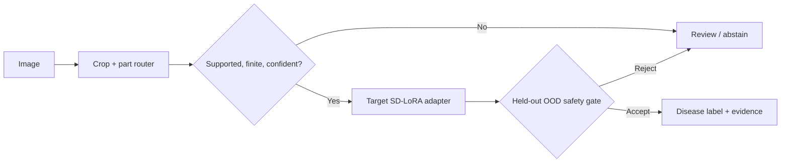

# AADS — Open-World Plant Disease Recognition

[](https://github.com/EfeErim/bitirmeprojesi/actions/workflows/ci.yml)
[](https://www.python.org/)
[](LICENSE)
[](evidence/controlled_demo_summary.json)

> A graduation-thesis project about the harder part of visual recognition: knowing when **not** to predict.

**Role:** ML / Computer Vision engineering · **Full-system stack:** Python, PyTorch, DINOv3, PEFT/LoRA, Colab
**Public scope:** a dependency-light engineering extract; not the private training dataset or full inference monorepo

AADS routes a plant image to a crop/part specialist, applies a target adapter, and returns either a disease label or a
safe `review` decision. I designed the selective-routing contract, continual adapter workflow, OOD gates, evidence
validation, and immutable artifact delivery around that decision.

## What is demonstrated here

- **Fail-closed selective routing** — unknown crops, unsupported parts, low-margin cases, invalid numeric scores, and
  negative-prototype conflicts are reviewed instead of being forced into a known disease.
- **Continual SD-LoRA design** — eight crop/part specialists use bounded replay, feature distillation, and adapter
  regularization to reduce forgetting.
- **Evidence-first delivery** — sanitized row-level decisions, immutable release identities, SHA-256 verification, and
  explicit deployment blockers keep a successful demo separate from unsupported production claims.

## Evidence — without overselling it

| Evidence surface | Result | What it proves |
|---|---:|---|
| Frozen controlled-demo decisions | **48 / 48 passed** | One curated CUDA demo run met its expected answer/review contract |
| Correct disease answers in that run | **36 / 36** | Correct labels on the supported rows selected for the demo |
| Safe review / abstain decisions | **12 / 12** | The selected unknown-crop, wrong-part, and non-plant rows were not diagnosed |
| Independent production-readiness gates | **0 / 8 passed** | No adapter is approved for autonomous deployment |
| Held-out ID accuracy across adapters | **0.785–0.950** | Classification quality varies materially by target |
| Held-out OOD false-positive rate | **0.283–0.873** | Unknown-disease rejection remains the primary blocker |

The `48/48` result is real, but it is a small controlled acceptance surface—not a field-performance estimate. The
public command validates the frozen identity and recomputes totals from 48 sanitized decision rows; it does **not**
rerun GPU inference. The original private system passed 1,132 regression tests at the public-transition snapshot, but
that is code-regression evidence, not additional model-accuracy evidence.

Machine-readable evidence:

- [`controlled_demo_summary.json`](evidence/controlled_demo_summary.json)
- [`controlled_demo_rows.json`](evidence/controlled_demo_rows.json)
- [`public_asset_manifest.json`](evidence/public_asset_manifest.json)

## Try the public contract

```bash
git clone https://github.com/EfeErim/bitirmeprojesi.git
cd bitirmeprojesi
python -m pip install -e ".[dev]"
python -m aads_public replay
python -m pytest
```

Expected CLI scope:

```text
AADS | GPU-free row snapshot validation
Manifest identity       PASS
Sanitized rows          48/48  PASS
Scope                    recorded decisions, not fresh inference | NOT production-ready
```

[Open the pinned evidence notebook in Colab](https://colab.research.google.com/github/EfeErim/bitirmeprojesi/blob/master/notebooks/evidence_snapshot.ipynb)
or inspect the [`continual_objective.ipynb`](notebooks/continual_objective.ipynb) walkthrough.

## System shape



The compact public package keeps four interview-relevant contracts executable:

- [`policy.py`](src/aads_public/policy.py) — fail-closed routing
- [`training.py`](src/aads_public/training.py) — continual objective and deterministic replay
- [`evidence.py`](src/aads_public/evidence.py) — strict row-level snapshot validation
- [`release.py`](src/aads_public/release.py) — bounded anonymous downloads with SHA-256 verification

Deeper context: [`MODEL_CARD.md`](docs/MODEL_CARD.md) · [`ENGINEERING_NOTES.md`](docs/ENGINEERING_NOTES.md)

## Model artifacts

The [v1.1.1 controlled-demo release](https://github.com/EfeErim/bitirmeprojesi/releases/tag/aads-public-demo-v1.1.1)
contains checksum-pinned adapter artifacts and complete per-target model cards. These artifacts are published for
engineering review and reproducibility of the artifact contract. They are explicitly `production_ready=false`, and
the full backbone/inference runtime is outside this compact public edition.

## Limitations

- Supported research targets are apricot, grape, strawberry, and tomato fruit/leaf specialists.
- The public repository does not redistribute the original datasets because file-level public redistribution rights
  are not sufficiently documented.
- The controlled snapshot cannot establish robustness across farms, cameras, seasons, geographies, or unseen diseases.
- The weights must not be used for treatment advice or autonomous agricultural decisions.
- Passing unit tests, checksums, or the 48-row snapshot does not override the failed production-readiness gates.

## License

Public code is released under the [MIT License](LICENSE). DINOv3-derived artifacts remain subject to the DINOv3
license distributed with each release bundle.
